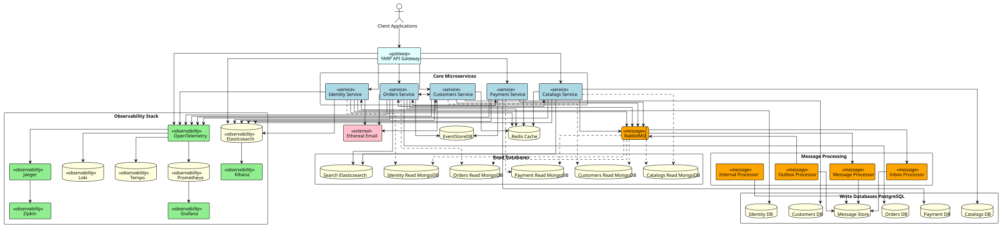

# Ground Truth Comparison

This compares our LLM-based decomposition results against a ground truth implementation of the same system using a microservices architecture.

## Reference Implementation

The original author of the monolithic codebase, Mehdi Hadeli, has created a microservices version of the same system which serves as our ground truth for comparison: https://github.com/mehdihadeli/food-delivery-microservices (atleast I am taking this as ground truth, but I am not sure if this is the best way to do it)

## Architecture Diagrams

### Ground Truth Microservices
The following diagram was generated by analyzing the README of the microservices implementation using our LLM pipeline:

### Static Analysis Only
This diagram shows the architecture derived purely from static code analysis, without behavioral analysis:
(This is just for reference to read my observations below)

## Personal Observations

### What no model captured?
Across all our experiments, several things present in the ground truth which were not identified:

1. Event Sourcing implementation
2. Dedicated message processors per service (separate outbox/inbox vs single message bus)
3. Caching mechanisms (Redis implementation)
4. Observability infrastructure (note: outside scope of decomposition)

### Did adding behavioural analysis improve the results?
Yes, our experiments demonstrate that incorporating behavioural analysis consistently improves decomposition quality. However, it still is not a match to the ground truth.

Of course. Here is a summary that directly addresses your points, focusing on the impact of including behavioral analysis in the architectural design process.

### The Impact of Behavioral Analysis on Architectural Models

| Aspect                     | WITHOUT Behavioral Analysis                                                                                                                                                                                | WITH Behavioral Analysis added                                                                                                                                                                                                                                 |
| :------------------------- | :--------------------------------------------------------------------------------------------------------------------------------------------------------------------------------------------------------- | :------------------------------------------------------------------------------------------------------------------------------------------------------------------------------------------------------------------------------------------------------------- |
| **Data Autonomy**          | Generally followed, but the diagram above is the main contradiction as it contains **shared database**.                                                                                                    | **Always Correct.** I think the process of analyzing domain boundaries and service interactions is preventing the shared database mistake.                                                                                                                     |
| **CQRS Consistency**       | **Inconsistent.** The most of the models applied CQRS partially. only static's intent was completely flawed by its shared DB.                                                                              | **More Mature atleast.** [decomposition-including-behavioural/static/4.0-used.svg](../decomposition-including-behavioural/static/4.0-used.svg) correctly applied CQRS to all relevant services and the rationale explained *why*—based on read/write patterns and data needs.                                              |
| **Caching (Redis)**        | **Almost entirely absent.** Only one of the five models ([decomposition-including-behavioural/static/3.5-used.svg](../decomposition-including-behavioural/static/3.5-used.svg)) included caching. The others completely missed this critical performance optimization. | **Sometimes Present.** [decomposition-including-behavioural/static/3.5-used.svg](../decomposition-including-behavioural/static/3.5-used.svg) explicitly included Redis *because* its rationale identified "heavy read patterns," directly linking the analysis to a concrete architectural improvement.                    |
| **Communication Patterns** | Showed a mix of sync/async calls, but the reasons for choosing one over the other were not clear.                                                                                                          | **Clear than before.** The rationale for [decomposition-including-behavioural/static/4.0-used.svg](../decomposition-including-behavioural/static/4.0-used.svg) explicitly defined a hybrid communication strategy: "synchronous HTTP calls for immediate data validation... and asynchronous... for eventual consistency." |

---
