### Prompt

> You are an expert software architect specializing in deriving system structure from behavioral models.
> 
> Your goal is to derive and generate a **formal component-level architecture diagram**. Your **sole source of information** for this task is the set of sequence diagrams provided in the behavioral_summary.md file in this workspace. You must infer the system's components and their relationships based only on the interactions shown in these diagrams.
> 
> **Your process should be as follows:**
> 
> 1. Identify all unique actors and participants across all the sequence diagrams. These will become the components in your diagram.
>     
> 2. Analyze the messages and interactions between these actors to determine the static relationships and dependencies. If one component sends a message directly to another, this implies a dependency that should be represented with a connecting arrow.
>     
> 3. Construct a component diagram that visually represents these components and their inferred dependencies.
>     
> 
> **Please output:**
> 
> 4. A **Mermaid diagram** in graph TB syntax that accurately reflects the component structure derived from the sequence diagrams. Ensure the component names in your diagram **exactly match** the actor names from the source sequence diagrams to maintain consistency.
>     
> 5. A short **rationale** (2-3 sentences) explaining how you identified the components and their primary relationships from the provided behavioral flows.
>

### Outputs
For comparison, these are two outputs - one generated by giving the complete `gitingest` codebase as input, and the other by giving only the sequence diagrams as input with the above prompt.

### Rationale

I identified the components by analyzing the grouped participants within each sequence diagram, treating each diagram as representing a distinct business module or bounded context. The primary relationships were derived from the message flows shown in the sequences: direct client interactions with specific modules, event-driven communication through the Message Bus (such as Identity Module publishing events consumed by Customer Management, and Product Catalog events consumed by Notification Service), and shared infrastructure dependencies like the MediatR pipeline and various databases. The component dependencies reflect both the synchronous request-response patterns and asynchronous event-driven integrations demonstrated across all the behavioral flows.

#### Complete Codebase

#### Sequence Diagrams Only
