# Table of Contents
- [Decomposition Strategy](#decomposition-strategy)
  - [Prompt 1](#prompt-1)
  - [Prompt 2](#prompt-2) 
  - [Prompt 3](#prompt-3)
  - [Prompt 4](#prompt-4)
  - [Prompt 4.5](#prompt-45)
  - [Prompt 5](#prompt-5)
- [Results](#results)
  - [Using existing artifacts (Eoan's generated artifacts)](#using-existing-artifacts-eoans-generated-artifacts)
  - [Using fresh artifacts (generated from scratch using the respective LLM)](#using-fresh-artifacts-generated-from-scratch-using-the-respective-llm)


# Decomposition Strategy

We used a 5-prompt strategy to generate the final system decomposition:

1. Initial component analysis
2. Component descriptions
3. Interface analysis 
4. Behavioral analysis (sequence diagrams)
5. Final decomposition

Before generating the final decomposition, we ensured the sequence diagrams were aligned with component names from the component diagram. This provided consistency when feeding the diagrams into the LLM for the final analysis.

## Prompt 1
```
You are an expert in software architecture and service decomposition, with a focus on quality-aware migration.

Analyze the codebase summary provided in the @gitingest-summary.txt file in this workspace. It is a modular monolith system.

Your goal is to generate a component-level architecture diagram that reflects the current system structure and interactions.

Please output:

- A Mermaid diagram in graph TB syntax showing the key components/modules and their interactions.
- A short rationale (2-3 sentences) explaining the component boundaries and communication patterns.

Only output the raw Markdown content. Do not include any other conversational text.

Save the output to a file named 01_component_diagram.md.
```

## Prompt 2
```
You are an expert in software architecture and service decomposition, with a focus on quality-aware migration.

Analyze the codebase summary provided in the @gitingest-summary.txt file in this workspace.

Based on the system's modular structure, generate a component overview table. For each component, include:

- Component Name
- Responsibility  
- Interfaces (key endpoints or methods)
- Depends On (other modules)
- Technologies (frameworks, DBs, patterns)

Present the result as a single, complete Markdown table. Only output the raw Markdown table. Do not include any other conversational text.

Save the output to a file named 02_component_descriptions.md.
```

## Prompt 3
```
You are an expert in software architecture and service decomposition.

Analyze the @gitingest-summary.txt file in this workspace for an overview of the modules.

Your goal is to extract a list of all public interfaces (HTTP endpoints) for each component. For each interface, include:

- Component Name
- HTTP Method
- Endpoint Path
- Brief Description

Present the results in a single, complete Markdown table. Only output the raw Markdown table. Do not include any other conversational text.

Save the output to a file named 03_api_endpoints.md
```

## Prompt 4
```
You are an expert in software architecture and service decomposition.

Analyze the @gitingest-summary.txt file in this workspace for a breakdown of the main modules.

Your goal is to identify the key implementation technologies used in each component. For each component, list:

- Component Name
- Language
- Frameworks
- Database
- Communication
- Patterns

Present the results as a single, complete Markdown table. Only output the raw Markdown table. Do not include any other conversational text.

Save the output to a file named 04_technology_map.md.
```

## Prompt 4.5
```
You are an expert in software architecture and service decomposition.

You will now perform the final, quality-aware microservice decomposition. Your analysis must be based on a complete view of the system, using all the context files available in the workspace.

Your context includes:

Static Analysis: The full static context provided in the files:
@01_component_diagram.md, @02_component_descriptions.md, @03_api_endpoints.md and @04_technology_map.md

Your Task:
Please output:

- A Mermaid diagram showing the proposed microservices and their interactions
- Use clear service names and group related functionality together
- Show communication paths (arrows), and optionally group into subgraphs
- A concise rationale (3–5 sentences) explaining the main decomposition choices
- Address domain boundaries, coupling/cohesion, communication patterns, and tech constraints

The proposed decomposition should reflect quality-aware design principles, including:
- High cohesion within services
- Low coupling between services  
- Data ownership and autonomy
- Scalability and maintainability
- Interface granularity

Save the output to a file named 05_final_decomposition_only_static.md.
```

## Prompt 5
```
You are an expert in software architecture and service decomposition.

You will now perform the final, quality-aware microservice decomposition. Your analysis must be based on a complete view of the system, using all the context files available in the workspace.

Your context includes two primary sources:

- Static Analysis: The full static context provided in the files
- Behavioral Analysis: The dynamic interaction flows and sequence diagrams provided in the @behavioral_summary.md

Your Task:
Synthesize all of this information to propose a microservice decomposition. It is critical that you use the sequence diagrams from the behavioral analysis to accurately model the communication patterns (e.g., synchronous REST calls vs. asynchronous events via a message bus) between the proposed services.

Please output:

- A Mermaid diagram showing the proposed microservices and their interactions.
- A concise rationale (3-5 sentences) explaining your decomposition choices. This rationale must address how the behavioral analysis from the sequence diagrams influenced your design, especially regarding communication patterns and service boundaries.

Only output the raw Markdown content. Do not include any other conversational text.

Save the output to a file named output.md
```

# Results
## Using existing artifacts (Eoan's generated artifacts)
| Model              | Diagram                                | Rationale Output |
|-------------------|----------------------------------------|------------------|
| **claude3.5-sonnet** |       | The proposed decomposition is driven by both domain boundaries and observed behavioral patterns in the sequence diagrams. The Identity service remains isolated with its own database and session cache, communicating primarily through events (as seen in the Customer Management sequence diagram) to maintain loose coupling. The Catalog and Customer services implement CQRS with separate read/write databases based on their heavy read patterns and complex domain events (evidenced in the Product Catalog and Supplier Management flows). The Order service is kept separate with its own database due to its unique transaction requirements and integration with external payment services (as shown in the Order Management sequence diagram). The Email service is extracted as a separate microservice based on its cross-cutting nature and high reuse across notification workflows (demonstrated in the Notification Service sequence diagram). |
| **claude4.0-sonnet** |       | The microservice decomposition preserves the existing bounded contexts while establishing clear service boundaries based on the behavioral analysis from the sequence diagrams. The Identity Service remains autonomous and publishes `UserRegistered` events asynchronously, which the Customer Service consumes to create customer records—eliminating direct dependencies. The Catalog Service operates independently and publishes `ProductRestocked` events that trigger notification workflows in the Notification Service, demonstrating proper event-driven communication. The Order Service maintains synchronous REST calls to both Catalog and Customer services for real-time data validation during order processing, as evidenced by the order placement sequence diagram, while also integrating synchronously with external payment gateways. This design leverages the existing CQRS patterns with separate read/write databases per service and uses the message bus for loose coupling between services, ensuring scalability and maintainability while respecting the communication patterns observed in the behavioral analysis. |
| **gemini2.5-pro**   |       | The proposed microservice decomposition aligns with the domain boundaries identified in the static analysis (Identity, Catalogs, Customers, Orders). The behavioral analysis from the sequence diagrams is crucial for defining the communication styles between these services, resulting in a hybrid architecture. For instance, the `Customer Service` is designed to react to `UserRegistered` events from the `Identity Service` asynchronously via a message bus, promoting loose coupling. Conversely, the `Order Service` must synchronously query the `Catalog` and `Customer` services via REST APIs to ensure immediate data consistency when an order is placed, a pattern directly observed in the interaction flows. This blend of synchronous and asynchronous communication creates a resilient and scalable system where services are autonomous yet can collaborate effectively. |


## Using fresh artifacts (generated from scratch using the respective LLM)
| Model              | Diagram                                | Rationale Output |
|-------------------|----------------------------------------|------------------|
| **claude3.5-sonnet** |      | The decomposition is driven by the behavioral patterns revealed in the sequence diagrams, particularly the clear separation between synchronous operations requiring immediate consistency (e.g., Customer service querying Identity for user validation) and asynchronous event-driven flows (e.g., OrderCreated triggering notifications). The CQRS pattern evident in the Catalog and Customer services' sequence flows justifies separate read/write databases, while the Payment service was extracted based on the complex transactional requirements shown in the payment processing sequence. The Notification service emerges as a separate concern due to its consistent pattern of consuming events from multiple services and managing reliable delivery through the outbox pattern, as demonstrated in the notification sequence diagram. |
| **claude4.0-sonnet** |      | The proposed microservice decomposition directly follows the existing modular boundaries (Identity, Catalog, Customer, Order) which already demonstrate strong cohesion and loose coupling. The behavioral analysis reveals a clear hybrid communication pattern: **synchronous HTTP calls for immediate data validation** (Order→Customer for verification, Order→Catalog for stock debit) and **asynchronous event-driven communication for eventual consistency** (UserRegistered, ProductRestocked events). Each service maintains its own CQRS data pattern with PostgreSQL for writes and MongoDB for optimized reads, ensuring data autonomy. The message bus becomes a first-class infrastructure component replacing the in-memory bus, while external services (Payment, Email) remain properly decoupled. This decomposition preserves the current system's proven interaction patterns while enabling independent deployment, scaling, and technology evolution per service. |
| **gemini2.5-pro**   |      | NA               |

